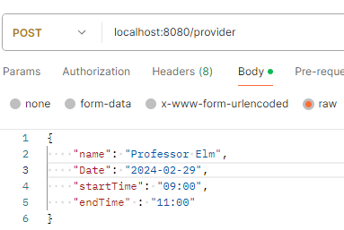
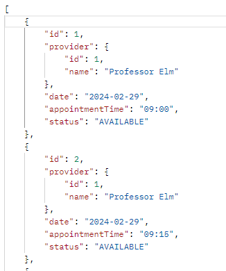
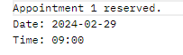
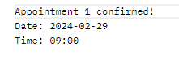

# Reservation
Backend Reservation system 

**Prerequisites**
* Docker v20.10.10 build b485636

**Running Project**
1. Clone from GitHub.
2. Build Docker image
3. Run docker image

```
git clone git@github.com:largodeivis/reservation.git
docker build -t reservation-app .
docker run -p 8080:8080 reservation-app
```


## Calling the API
### Add Provider with Availability
_POST_ Request to _/provider/_ with a request body.
```
localhost:8080/provider
```


**Request Body**
```
{
    "name": "Professor Elm",
    "Date": "2024-02-29",
    "startTime": "09:00",
    "endTime" : "11:00"
}
```




### View Available Appointments
_GET_ Request to _/appointments/_ with a request body.
```
localhost:8080/appointments
```

**Result**




### Reserve Available Appointments
_POST_ Request to _/appointments/reserve/{appointmentId}/_ with a request body.
```
localhost:8080/appointments/reserve/1
```

**Result**



### Confirm Reserved Appointments
_POST_ Request to _/appointments/confirm/{appointmentId}/_ with a request body.
```
localhost:8080/appointments/confirm/1
```

**Result**

